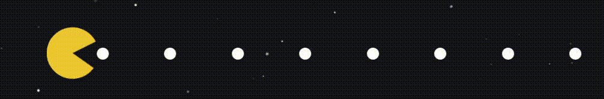

<!-- Banner -->

  

  
# ꒰(˶• ᴗ •˶)꒱

### Creative Frontend Developer • Aspiring Full-Stack Developer • UI/UX Enthusiast

  

---

## ✨ About Me

I like making stuff, and then making it look pretty. I build clean, intuitive interfaces that blend creativity with logic. Currently growing into full-stack development while staying true to my design roots. I love creating projects that feel good to use and fun to interact with.

---

## 🔌Connect with Me

  

---

## 🚀 Tech Stack

### ✨ Frontend

  
  
  
  
  
  

### ⚙️ Backend

  
  

### 🪐 Languages

  
  
  
  

### 💫 Databases

  
  
  
  

### 🌟 Tools & Extras

  
  
  
  

---

## 🎮 Hobbies

- Talking About My Dog („• ֊ •„)੭
- Origami 𓅯
- Game development (Unity and prototypes)
- Blender 
- Learning new stacks and tackling at new frameworks until they make sense

---

## 🌟 Fun Facts

- I love building things that are functional but still have personality
- I love Axolotls ᓬ(•̀ - •́)ᕒ
- I'm a Cancer survivor
- I love video games, but don't play any competitive ones

---

## 📊 GitHub Stats

  

---

*Enjoy your day*

